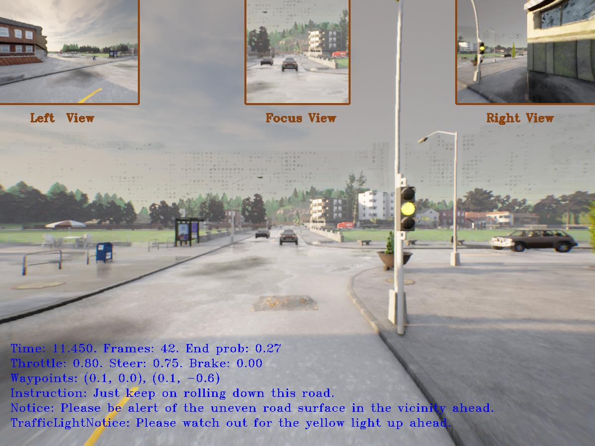
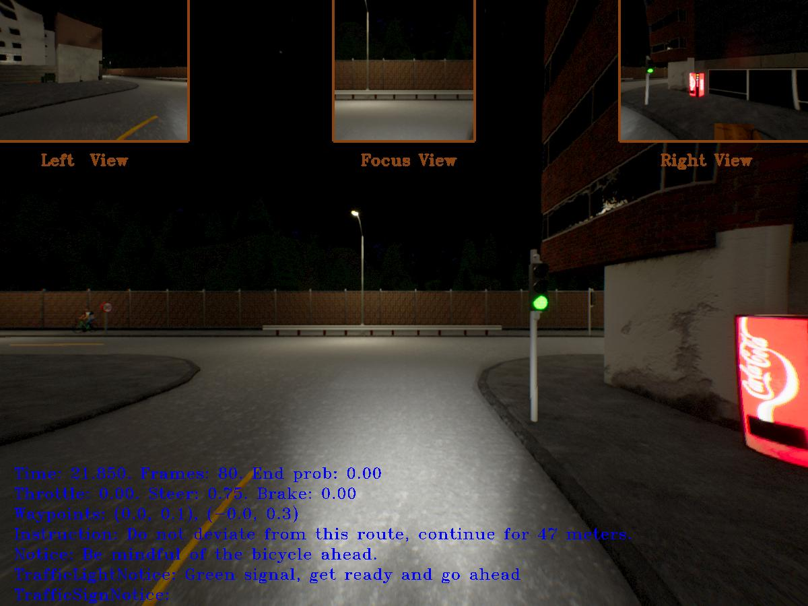
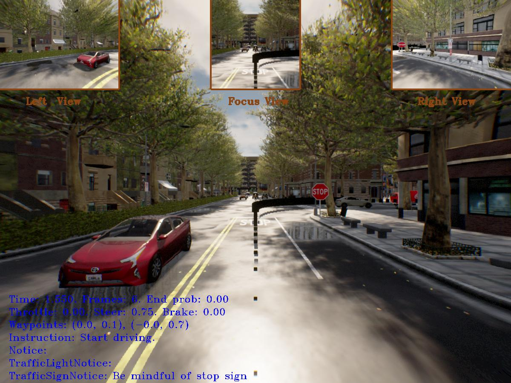

Hi  Welcome to Noushiq's Repo
================================================================================================================================

 <a href="https://www.github.com/nomadka" target="_blank" rel="noreferrer"> <picture> <source media="(prefers-color-scheme: dark)" srcset="https://raw.githubusercontent.com/danielcranney/readme-generator/main/public/icons/socials/github-dark.svg" /> <source media="(prefers-color-scheme: light)" srcset="https://raw.githubusercontent.com/danielcranney/readme-generator/main/public/icons/socials/github.svg" />  </picture> </a> <a href="https://www.linkedin.com/in/noushiq" target="_blank" rel="noreferrer"> <picture> <source media="(prefers-color-scheme: dark)" srcset="https://raw.githubusercontent.com/danielcranney/readme-generator/main/public/icons/socials/linkedin-dark.svg" /> <source media="(prefers-color-scheme: light)" srcset="https://raw.githubusercontent.com/danielcranney/readme-generator/main/public/icons/socials/linkedin.svg" />  </picture> </a>

AI and Computer Vision Enthusiast | Autonomous Systems | Data Engineering | Automotive Engineering
--------------------------------------------------------------------------------------------------

AI and Computer Vision engineer working at the intersection of perception, machine learning, and autonomous systems. I enjoy diving deep into data, writing practical code, and shaping ideas into deployable solutions.

* 🌍  I'm based in Germany
* ✉️  You can contact me at [noushikayilan@gmail.com](mailto:noushikayilan@gmail.com)
* 🧠  I'm currently learning Vision Language Models, Sensor Fusion, World Model
* 👥  I'm looking to collaborate on Computer Vision and AI related projects

### 📚 Publication
[Enhancing LLM-based Autonomous Driving with Modular Traffic Light and Sign Recognition](https://arxiv.org/abs/2511.14391)

###  TLSR: Modular Traffic Light & Sign Recognition

<table>
  <tr>
    <td width="60%">
      <strong>Enhancing LLM-based Autonomous Driving</strong>
        
      

      This work introduces TLSR, a modular architecture designed to enhance LLM-based autonomous driving systems through explicit traffic light and traffic sign reasoning. The proposed framework integrates seamlessly with existing LLM-driven planners such as LMDrive and BEVDriver and operates in a closed-loop simulation environment using CARLA. A state-of-the-art object detection model is pre-trained and fine-tuned to accurately detect traffic lights and traffic signs within the simulation. To improve robustness, the architecture incorporates a relevance prediction algorithm and a state validation mechanism to reduce misclassifications. Detected traffic cues are transformed into structured natural language representations and injected into the LLM input, enforcing attention to safety-critical elements. The framework is plug-and-play, model-agnostic, and supports both single-view and multi-view camera configurations. Extensive evaluation on the LangAuto benchmark demonstrates driving performance improvements of up to 14% over LMDrive and 7% over BEVDriver, alongside a consistent reduction in traffic light and traffic sign infractions.
        
      <ul>
        <li><b>Key Tech:</b> Computer Vision, Autonomous Driving VLMs, Python, PyTorch, OpenCV </li>
      </ul>
    </td>
  </tr>
  <tr>
    <td colspan="2">
      

        
        
        
      

    </td>
  </tr>
  </tr>
</table>